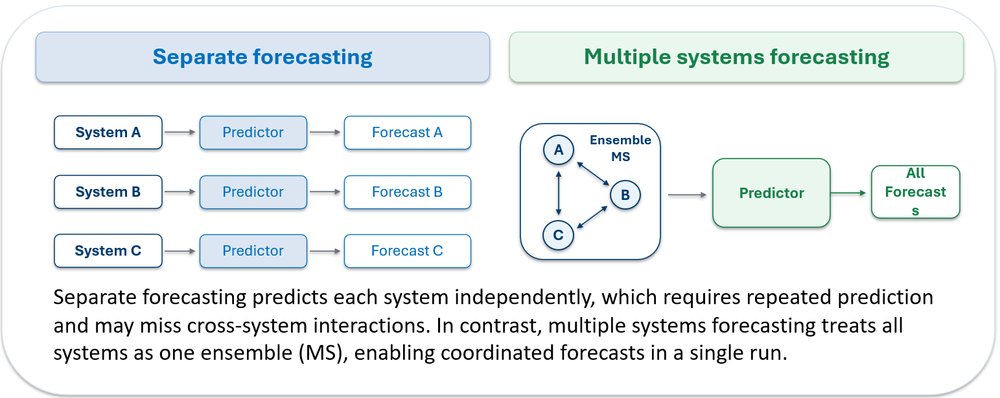
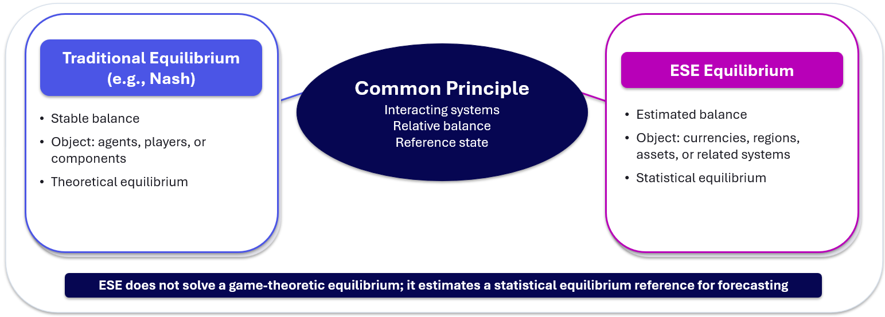
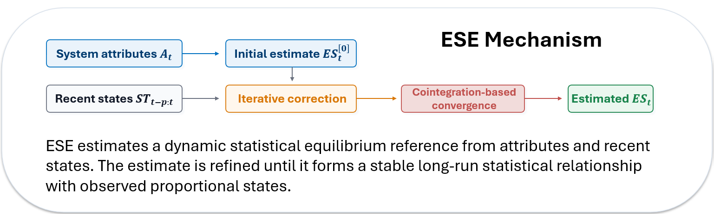

# Overview

<p align="center">
  
</p>


Many forecasting tasks involve multiple interacting systems, such as currencies, regions, markets, or public-health units. Conventional forecasting methods usually predict each system separately, which can be repetitive, computationally costly, and may miss system-level interactions.

Equilibrium State Estimation (ESE) addresses this problem by treating all systems as an ensemble. Instead of forecasting each target independently, ESE estimates a statistical equilibrium state across systems and generates coordinated forecasts for all systems in a single run.

## What is ESE?

<p align="center">
  
</p>

ESE is based on the idea that interacting systems can be represented by their proportional states within a larger ensemble. The current state describes the observed proportions of all systems, while the estimated equilibrium state provides a statistical reference under the current system attributes.

ESE does not solve a game-theoretic equilibrium. Instead, it estimates a statistical equilibrium reference for forecasting.

## ESE Mechanism

<p align="center">
  
</p>

The ESE mechanism consists of three main steps:

1. Estimate an initial equilibrium state from system-level attributes.
2. Refine the equilibrium estimate using recent historical states.
3. Generate forecasts based on the deviation between the current state and the estimated equilibrium state.

ESE can be used as a standalone forecasting method or combined with existing predictors. When combined with a base predictor, the base model forecasts the aggregate trend, while ESE allocates the aggregate forecast across individual systems.


# Data

This directory contains the datasets used for the paper:

**Once-for-All: Scalable Simultaneous Forecasting via Equilibrium State Estimation**

The datasets are designed for evaluating simultaneous forecasting across multiple interacting systems. Each dataset contains multiple systems, where each system has a target time series and a shared set of system-level attributes.

## Dataset Overview

The released data include three groups:

1. **Synthetic data**
   Controlled multi-system datasets generated for evaluating ESE under different system sizes, input lengths, and prediction horizons.

2. **Currency exchange-rate data**
   Daily exchange rates of 16 non-USD G20 currencies relative to the USD, together with macro-financial attributes.

3. **COVID-19 regional data**
   Daily new COVID-19 cases in Victoria, Australia, represented at multiple spatial granularities: 20 aggregated regions, 79 municipalities, and 320 postcode-level regions.

## Important Notes

* All systems in the same dataset should be consistently included over time.
* Each system should share the same attribute set.
* The target values are converted into proportions internally when ESE estimates the equilibrium state.
* For fair comparison, the same train/test split should be used across ESE and baseline models.

## Responsible Use

The datasets include real-world information from financial and public-health domains. They are released for research purposes. Results produced using these datasets should not be interpreted as financial, medical, or policy advice.

# Citation

If you use the datasets, please cite:

```bibtex
@inproceedings{xu2026onceforall,
  title     = {Once-for-All: Scalable Simultaneous Forecasting via Equilibrium State Estimation},
  author    = {Xu, Beinan and Song, Andy and Gao, Jiti and Liu, Feng},
  booktitle = {Proceedings of the 43rd International Conference on Machine Learning},
  year      = {2026},
  series    = {Proceedings of Machine Learning Research}
  url       = {https://arxiv.org/abs/2606.13285}
}
```
